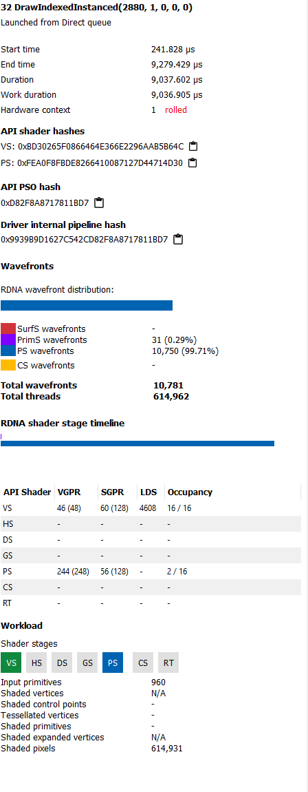
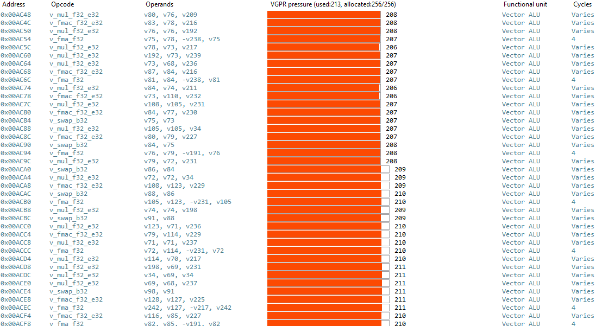
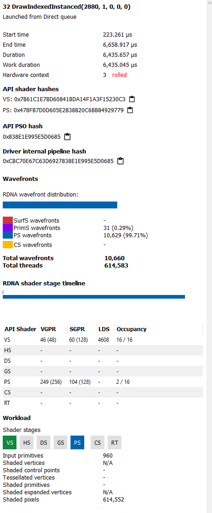
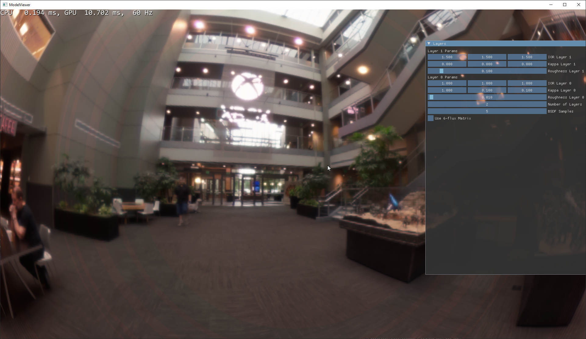
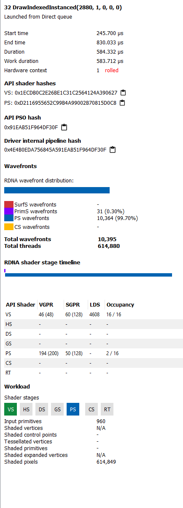
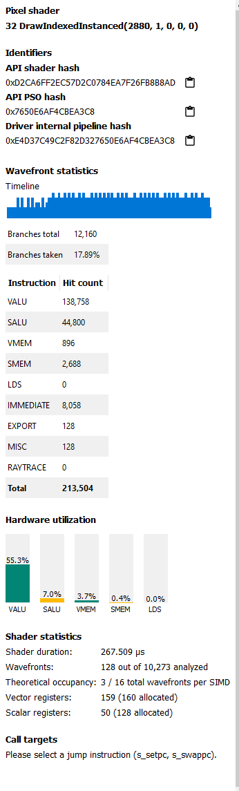

# Performance Findings July 2024

Performance for the 2-flux Transfer Matrix averaged around 2-5ms in the test sphere scene, for 2 layers. Performance for the 6-flux matrix
averaged around 12ms in the same scene, with the same layer setup. 

Profiling shows that the register pressure for both implementations is very high, and as a result occupancy is very low. The shader also has very high
'scratch' memory usage, ~9KB.





The worst pressure is in the loop where the transfer matrices for each layer are composed together (`outgoing_lobes`). These
are large structures, 80 bytes each for both energy and asymmetry matrices, when using full precision floats.  

```hlsl
struct tensor3d6x6
{
    uint type;
    
    
    //row 1
    real3 _11;
    real3 _21;
    real3 _31;
    real3 _41;
    real3 _51;
    real3 _61;
    
    //row 2
    real3 _12;
    real3 _22;
    real3 _32;
    real3 _33;
    real3 _34;
    real3 _35;
    real3 _36;

    real3 _42;
    real3 _43;
    real3 _44;
    real3 _45;
    real3 _46;
    
    real3 _52;
    real3 _62;
    
 
};
```
Similarly, the per-lobe operator structure is 99 bytes (for full precision floats):
```hlsl

struct layer_components_tm6
{
    uint type;
    struct {
        henyey_greenstein reflection_down;
        henyey_greenstein transmission_down;
        henyey_greenstein reflection_up;
        henyey_greenstein transmission_up;
        
        henyey_greenstein reflection_down_secondary;
        henyey_greenstein transmission_down_secondary;
        henyey_greenstein reflection_up_secondary;
        henyey_greenstein transmission_up_secondary;
        
    } interface_type;
    
    struct
    {
        henyey_greenstein primary_flux_transmission;
        henyey_greenstein secondary_flux_backward_reflection;
        henyey_greenstein secondary_flux_forward_transmission;
        
    } media_type;
};
```

As it's a pixel shader, increasing the occupancy of the wavefront should allow more pixels to be processed in a given dispatch,
and so improve the performance. The easiest way to reduce register pressure is to use lower precision (and thus smaller) types where possible.
I added a compile time switch for a `real` typedef to swap between full and half (`min16float`) precision types. Everything uses this new `real` type,
except for ray directions and the PDF loop. 

Incorporating this switch improves performance on the 6-flux matrix by... 0.5ms! Not dramatic. Register pressure reduces by 6 VGPRs,
but somehow scalar occupancy approximately doubles - this may just be the compiler realising it could scalarise things better for whatever reason, so i expect these gains to
disappear under a textured implementation of the model (that is, the per-pixel layer data is no longer uniform). 
Occupancy does not improve at all, so this performance benefit is likely purely a result of the double rate computation for half types. ALU utilisation improves by 1 percentage
point - 6.1%!




Scratch usage is improved to ~6KB, but register pressure is not improved significantly. There are also still many f32 operations in the instruction stream,
likely due to conversions from the full precision CBV to the half precision computation. The Karis split sum FGD approximation appears to make zero difference to the frame time, although it
is still worth considering as it is significantly lighter than the full FGD LUT. 

Visually, the half precision types appear to introduce prominent banding on low roughness surfaces:


Dropping the TIR term from the 2-flux model improved time *significantly*, dropping from ~950 microseconds to 584, despite increasing VGPR pressure. This seems to be due to better VALU utilisation - increasing to 27%.




It's unclear whether this is due to branching (which should be scalar across the warp due to the layer parameters being constant), or if the resource load itself is too costly. It may be worth dropping the TIR
term entirely, although this will harm the energy conservation of the model.



Using a resampled form of the TIR and FGD LUTs with R16 formats rather than R32 improves speed *significantly* - 227 microseconds! VALU utilisation increases to 55% in this case. 
There seems to be some problem with numerical robustness however, as NaNs are introduced under high roughnesses.


Dropping the unused mean term from the HenyeyGreenstein representation seems to improve performance of the 2-flux model to 950 microseconds...