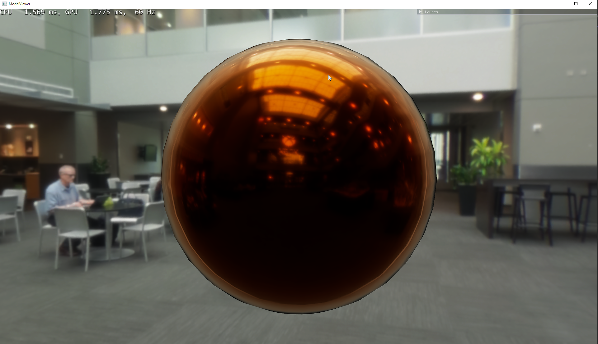
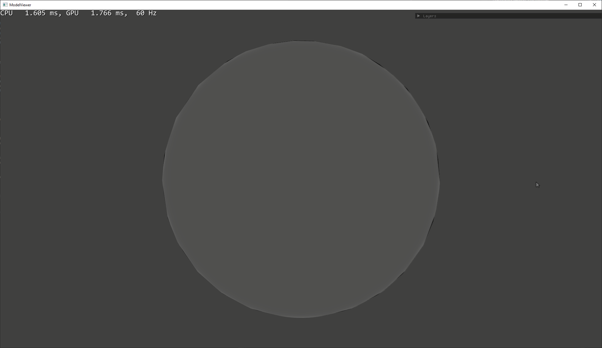

# Layered Materials with Transfer Matrices (In Real Time)

This is a work in progress implementation of the 2-flux
transfer matrix based layered material framework presented
by Randrianandrasana et al (2021) in "Transfer Matrix Based Layered Materials Rendering".

The core of this work so far is reimplementing the 2-flux
transfer matrix model as a pixel shader for a forward rendered raster engine written with DirectX 12. 
The two-flux model tracks the reflected and transmitted flux occuring at interface boundaries between media in
a 2x2 matrix. Therefore, the reflected and transmitted light energy for a stack of interfaces may be approximated by
multiplying their associated transfer matrices together. The authors adapt Belcour's multi-lobe statistics in "Efficient rendering of layered materials using an atomic decom
position with statistical operators." for transfer matrices by approximating the statistics with the Henyey-Greenstein phase function, which is stable under convolution.

*Rough refracting dielectric layer over a conducting substrate*.

The primary work for this implementation thus far involved adapting the model for working with preintegrated
lighting. This means that rather than sample the BSDF stochastically, selecting an outgoing direction from the VNDF, 
we instead fix the outgoing direction at a perfect mirror reflection (i.e 90 degrees to the incoming direction). Then, 
for each lobe generated by the transfer matrix evaluation, we sample the IBL at the outgoing direction (LODed by that lobe's outgoing asymmetry, fit back to the GGX roughness space), and weight it
by the throughput for that lobe. The final lighting result for this sample is the sum of these lobe samples, weighted by the probabilities
distribution function. 
 
This is still buggy, in particular it does not appear to be energy conserving, emitting *more* energy than was incident:

Higher roughnesses also show a darkening indicating energy loss.

Frame time in the sample Atrium scene is generally around 1-2ms, with 2 layers. Increasing the number of layers adds approximately 0.1ms each. 

Bizarrely, enabling optimisations *pessimises* this runtime, increasing to approximately 5ms. 

### Further Work
I would like to replace the 4D FGD LUT used in the paper with a cheaper solution. Looking this LUT up requires 3 different texture samples (one for each entry in the IOR/Kappa vector), 
per computed layer. The LUT itself is also very heavy, at 64MB. The full size version will not even fit within the DirectX resource limits - for this implementation I reshaped it to a
64x64x2048 3D LUT, with the 4th Kappa dimension resampled to 32 entries wide, and indexed linearly alongside the IOR. 

There does exist the split-sum approximation (Karis, 2013), which this implementation includes a compile time switch for. This lacks the complex IOR term that is important for calculating the
albedo of conductor layers. A comparison is given below:

Performance appears to be unaffected (implying there is enough work to do that sampling is not a bottleneck), and results are very similar. The split sum approximation appears to show a higher degree
of roughness sooner.

I would also like to look at employing a simpler Fresnel form, while preserving accuracy, such as that proposed by Belcour et al in 'Bringing an Accurate Fresnel to Real Time Rendering, a Preintegrable Decomposition' (SIGGRAPH 2020)

The majority of the runtime however appears to be dominated by the layer evaluation, and so virtualisation methods for statically (and dynamically) merging layer statistics should be considered, such as
what is employed in the Substrate framework (De Rousiers et al, 2023). 

It is possible too that I should be weighting each lobes IBL sample direction by the outgoing mean, so that specular highlights decorrelate as should happen in a multi layer material. 

### References
Laurent Belcour, Mégane Bati, and Pascal Barla. 2020. Bringing an Accurate Fresnel to Real-Time Rendering: a Preintegrable Decomposition. In ACM SIGGRAPH 2020 Talks (SIGGRAPH '20). Association for Computing Machinery, New York, NY, USA, Article 76, 1–2. https://doi.org/10.1145/3388767.3407325

Laurent Belcour. 2018. Efficient rendering of layered materials using an atomic decom
position with statistical operators. ACM Transactions on Graphics (TOG) 37, 4 (2018),
 73.

Joël Randrianandrasana, Patrick Callet, and Laurent Lucas. 2021. Transfer matrix based layered materials rendering. ACM Trans. Graph. 40, 4, Article 177 (August 2021), 16 pages. https://doi.org/10.1145/3450626.3459859

de Vries, J. (2020). Learn OpenGL. Learn modern OpenGL graphics programming in a step-by-step fashion. https://learnopengl.com/PBR/IBL/Specular-IBL      

Hillaire S. & de Rousiers C. (2023) Authoring Materials That Matters: Substrate in Unreal Engine 5. Advances in Real Time Rendering in Games. SIGGRAPH 2023. https://advances.realtimerendering.com/s2023/2023%20Siggraph%20-%20Substrate.pdf
  

